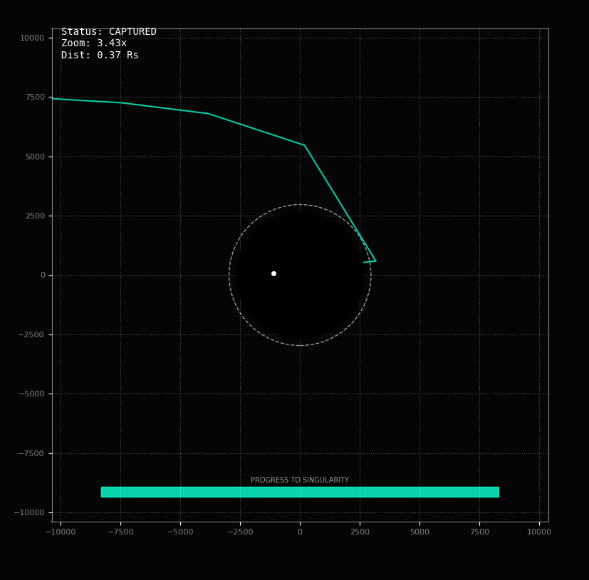
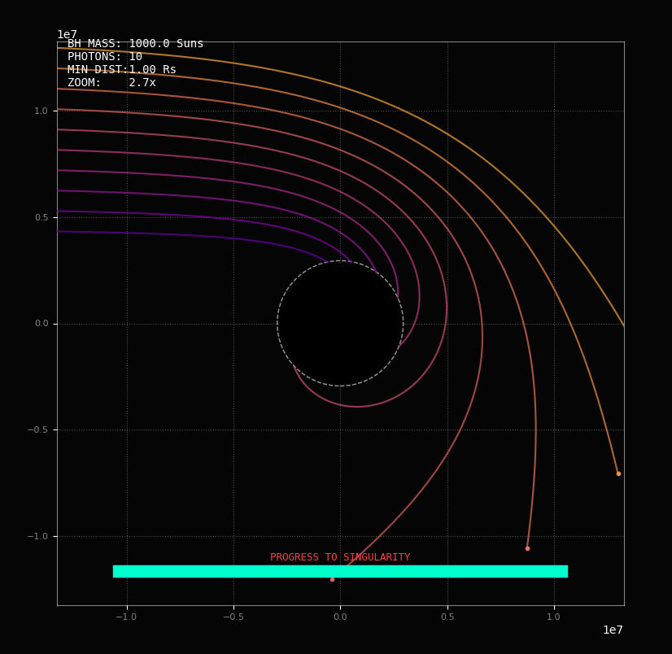
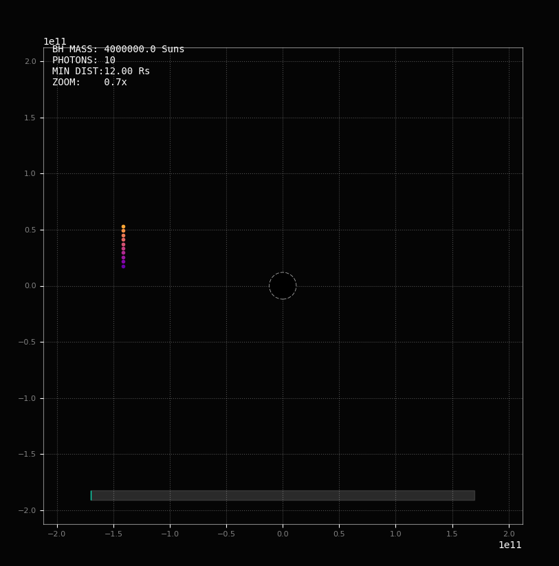

# Project Title: Implementation Animation of Blackhole 

**Base Formula:** Mathematical Simulation of the Schwarzschild Radius 

## 1. Honesty Statement
This project was generated with the assistance of AI (Gemini) and refined by Me. 

* **Mathematical Theory:** Based on standard General Relativity equations and my researches. 
* **Code:** The core logic was generated by AI with formulas that have been given and modified for visualization. 

## 2. Mathematical Background
The most critical mathematical concept regarding black holes is the Schwarzschild Radius ($R_s$). It defines the radius of the "Event Horizon" the sphere around a mass where the escape velocity required exceeds the speed of light ($c$). 


The formula is derived from the escape velocity equation $v_{e}=\sqrt{\frac{2GM}{r}}$. By setting $v_{e}=c$, we get: 

$$R_{s}=\frac{2GM}{c^{2}}$$

**Variables:** * **$G$:** Gravitational Constant $\approx6.674\times10^{-11}m^{3}kg^{-1}s^{-2}$ 
* **$M$:** Mass of the object (kg) 
* **$c$:** Speed of light $\approx2.998\times10^{8}m/s$ 

This linear relationship shows that a black hole's size is directly proportional to its mass. 

## 3. Python Formula Based Implementation
This script calculates the radius and generates a visual representation of the black hole's scale. 

```python
SOLAR_MASSES = 1000.0 # 1.0 Our Sun, 10.0 Large Star, 4000000.0 Supermassive
G = 6.674e-11
M = SOLAR_MASSES * 1.989e30 # Actual mass in kg
c = 3e8 # Speed of light
Rs = (2 * G * M) / (c**2) # Schwarzschild Radius
```

## 4. Learning Summary & Observations
This code is a Python-based calculation of the Schwarzschild Radius and implementation for a hypothetical object (Blackhole) with the mass of 1,000 Suns. I make the Mass of Blackhole so It can be adjusted depends on data needs and experiment. 

The Schwarzschild Radius is essentially the "point of no return" for a black hole. If you were to compress an object's mass into a sphere with this radius, the gravitational pull would become so strong that not even light could escape. 

**Break Down Explanation:**

* **Mass Definition (SOLAR MASSES & M):** * The code starts with the mass of our Sun ($1.989 \times 10^{30}$ kg). 
    * It multiplies this by 1000.0 to simulate an Intermediate-Mass Black Hole. 

* **Physical Constants (G & c):** * **$G$:** The Universal Gravitational Constant, which determines the strength of gravity. 
    * **$c$:** The speed of light (approx. 300,000,000 meters per second). 

* **The Calculation (Rs):** * This line implements the physics formula to find the radius of the Event Horizon. 

## 5. Implementation Animations of Blackhole Using Py and Math

**Animated Photon Trajectory near a Black Hole**
**Method:** I used the `matplotlib.animation` library to solve and visualize the motion of a particle under a simplified gravitational pull. 

### Mathematical Logic for Animation
In a simplified Newtonian-Relativistic hybrid model, we simulate the acceleration of a particle toward the center: 

1. **Gravity Force:** $a=\frac{GM}{r^{2}}$ 
2. **Event Horizon:** If the particle's distance $r < R_s$, it is "captured" and stops. 
3. **Time Stepping:** We use small increments of time ($\Delta t$) to update the velocity and position: 
    * $v_{new} = v_{old} + a \cdot \Delta t$ 
    * $p_{new} = p_{old} + v_{new} \cdot \Delta t$ 

### The Physics Implementation (The Movement)
This part of the `BlackHole Photon` class determines how the light bends and "updates" its position for each frame. 

```python
def update(self):
    if self.captured: return
    p, v = self.pos, self.vel
    
    k1_v = self.get_accel(p, v) * dt
    k1_p = v * dt
    
    k2_v = self.get_accel(p + k1_p/2, v + k1_v/2) * dt
    k2_p = (v + k1_v/2) * dt
    
    k3_v = self.get_accel(p + k2_p/2, v + k2_v/2) * dt
    k3_p = (v + k2_v/2) * dt
    
    k4_v = self.get_accel(p + k3_p, v + k3_v) * dt
    k4_p = (v + k3_v) * dt
    
    self.vel += (k1_v + 2*k2_v + 2*k3_v + k4_v) / 6
    self.pos += (k1_p + 2*k2_p + 2*k3_p + k4_p) / 6
    
    self.path.append(self.pos.copy())
    
    # Stop moving If inside the event horizon
    if np.linalg.norm(self.pos) < Rs: self.captured = True
```

The core math happening there is: 
$$a=\frac{GM}{r^{2}}\times\left(1+\frac{3 L^{2}}{r^{2}c^{2}}\right)$$

* **$\frac{GM}{r^{2}}$:** This is the standard Newtonian gravity. It pulls the photon toward the center. 
* **The "Correction" Term $\left(1+\frac{3L^{2}}{r^{3}c^{2}}\right)$:** This comes from the Schwarzschild Metric. 

In classical physics, light wouldn't bend much, but in General Relativity, the "Angular Momentum" ($L$) of the light causes it to curve drastically. This is why light can actually orbit a black hole in a circle. 

### The Integration Formula (The RK4 Method)
The `update` function uses the 4th Order Runge-Kutta (RK4) method. This is the "Gold Standard" for simulations. Because the gravity near a black hole changes so rapidly, a simple "move move move" approach (Euler method) would cause the photons to fly off in the wrong direction due to math errors. 


RK4 solves this by taking four "mini-steps" to predict the curve of the path: 

| Step | What it does |
| :--- | :--- |
| **k1** | Looks at the current slope (acceleration/velocity). |
| **k2** | Peeks ahead to the midpoint using the slope from k1. |
| **k3** | Peeks ahead to the midpoint again, but more accurately using k2. |
| **k4** | Peeks all the way to the end of the step using k3. |

**The Final Move:** The code then takes a weighted average of all four "peeks" to calculate the final position: 
$$Next Position = Current + \frac{dt}{6}(k_{1}+2k_{2}+2k_{3}+k_{4})$$

**Why is this necessary?** Without this specific RK4 formula, the photons would either: 
1. **"Teleport"** inside the black hole instantly. 
2. **Spiral incorrectly** because the computer can't keep up with how fast the gravity is changing near the Event Horizon. 

RK4 ensures that even though we are moving in discrete "ticks" of time, the path looks like a smooth, natural curve.

### The Animation Function (The Scene Manager)
This code runs repeatedly to redraw the lines and zoom the camera as the "simulation" progresses. 

```python
def animate(i):
    for p in photons:
        for _ in range(substeps):
            p.update()
    
    current_dists = [np.linalg.norm(p.pos) for p in photons]
    min_dist_now = min(current_dists)
    
    if min_dist_now < tracking["min_dist_ever"]:
        tracking["min_dist_ever"] = min_dist_now
        
    # Camera zoom
    view_size = max(Rs*4.5, tracking["min_dist_ever"] * 1.5)
    ax.set_xlim(-view_size, view_size)
    ax.set_ylim(-view_size, view_size)
    
    for p, line, pt in zip(photons, lines, points):
        if p.path:
            pts = np.array(p.path)
            line.set_data(pts[:, 0], pts[:,1])
            
            if p.captured:
                pt.set_visible(False)
            else:
                pt.set_data([pts[-1, 0]], [pts[-1, 1]])
                
    # Progress Calculation
    progress = np.clip((START_DIST - min_dist_now) / (START_DIST - Rs), 0, 1)
    progress_fill.set_width(progress * 0.8)
    
    if progress > 0.95:
        bar_label.set_color('#FF4444')
        bar_label.set_alpha(1.0)
        for label in ax.get_xticklabels() + ax.get_yticklabels():
            label.set_alpha(0.5)
```

### The Coordinate Axis
```python
# Axis and Grid Styling
ax.grid(True, color='white', linestyle=':', alpha=0.3)
for spine in ax.spines.values():
    spine.set_edgecolor('white')
    spine.set_alpha(0.5)
ax.tick_params(axis='both', colors='white', labelsize=8)
```

**Explanation of the properties used:**

* **alpha:** This is the most important parameter for transparency. A value of 1.0 is solid, and 0.0 is completely invisible. You are using 0.3 and 0.5 to give it that "ghostly" scientific look.
    $$C_{out}=\alpha C_{src}+(1-\alpha)C_{dest}$$

* **ax.spines:** In Matplotlib, "spines" are the four lines that form the rectangle around the plot. By looping through values (), you apply the same color and transparency to all four sides at once.

* **ax.tick_params:** This is a "one-stop shop" for styling the axis markers (the tiny lines) and the labels (the numbers).
    $$x_{screen~n}=\frac{x-x_{min}}{x_{max~x}-x_{min}}$$

* **linestyle=':':** This creates the dotted grid instead of a solid line, which helps the photon paths stand out more clearly.

**Why this helps my project:** showing the coordinate axes is very helpful for a math project because it proves the scale is changing. Your teacher will be able to see the numbers on the X and Y axes shrinking as the "Camera" zooms in, which visually demonstrates the Schwarzschild Radius measurement in meters or $R_s$ units.

### The Progress Bar
The progress bar in the code is a dynamic UI element that visualizes how close the photons are to the Event Horizon (The Schwarzschild Radius). It isn't just a simple timer; it is linked directly to the physics of the simulation.

```python
bar_label = ax.text(0.5, 0.08, 'PROGRESS TO SINGULARITY', transform=ax.transAxes, color='white', alpha=0.8, ha='center', fontsize=9, family='monospace', zorder=20)
progress_bg = patches.Rectangle((0.1, 0.05), 0.8, 0.02, transform=ax.transAxes, color='grey', alpha=0.3, zorder=19)
progress_fill = patches.Rectangle((0.1, 0.05), 0.0, 0.02, transform=ax.transAxes, color='#00FFC0', alpha=1.0, zorder=20)

ax.add_patch(progress_bg)
ax.add_patch(progress_fill)
```

## 6. More About Blackhole, Photon and Photon Implementation

Black holes are one of the most fascinating "extreme" environments in our universe. Because their gravity is so intense that not even light can escape, we can't see them directly but we can see the chaos they cause around them.

**The Anatomy of a Black Hole**
To understand a black hole, you have to look at its layers:
1. **The Singularity:** The very center where matter is crushed into an infinitely small point of infinite density. Here, our current laws of physics (General Relativity) break down.
2. **The Event Horizon:** The "point of no return." Once you cross this boundary, the escape velocity required exceeds the speed of light.
3. **The Accretion Disk:** A swirling "doughnut" of gas and dust orbiting the black hole. Friction heats this material to millions of degrees, making it glow brightly in X-rays.
4. **Relativistic Jets:** Some black holes "burp" out massive beams of particles at nearly the speed of light, shooting them thousands of light-years into space.
5. **A photon sphere:** or photon ring or photon circle, arises in a neighbourhood of the event horizon of a black hole where gravity is so strong that emitted photons will not just bend around the black hole but also return to the point where they were emitted from and consequently display boomerang-like properties.

**Key Properties of a Photon**
* **Massless:** A photon has zero "rest mass." This is why it can travel at the universal speed limit—the speed of light—without requiring infinite energy.
* **Charge:** It is electrically neutral (zero charge).
* **Speed:** In a vacuum, it always travels at $c \approx 3 \times 10^8 \text{m/s}$.
* **Wave-Particle Duality:** It acts like a wave (it can interfere and diffract) and like a particle (it can "hit" an electron and knock it out of an atom, as seen in the photoelectric effect).
* **Spin:** It is a boson with a spin of 1, meaning multiple photons can occupy the same quantum state (which allows for lasers).

### Photon Implementation
Here's photo of photon implementation in my project:

<p align="center">
  
</p>

At start-up I used only one photon to simulate the formula, and then I add 10 more photons to have full visualization of photon that called Multi-Photon Trajectories beam.

**How the formula works**
I visually demonstrating Scattering Theory:
1. **Scattering Theory** is a framework used to study how moving particles (like photons or electrons) are deflected or "scattered" when they interact with a target object—in this case, a black hole.
2. **Impact Parameter $b$:** The $y_{start}$ value.
3. **Capture Cross-Section:** The formula in the image defines the critical limit for whether a photon will be "captured" (fall into the black hole) or "scattered" (bend and fly away).

The formula is written as:
$$b < \sqrt{27} \times \frac{GM}{c^{2}}$$

**Breaking down the math:**
* **The Gravitational Radius:** Recall that the Schwarzschild Radius is $R_s$. This means that $\frac{GM}{c^2}$ is exactly half of the Schwarzschild Radius (0.5 $R_s$).
* **The $\sqrt{27}$ Constant:** $\sqrt{27}$ is approximately 5.196.
* **The Result:** When you multiply them together: $5.196 \times 0.5 R_s \approx 2.598 R_s$.

I simplify it as any photon with a $b < \sqrt{27} \times \frac{GM}{c^2}$ (approx $2.6 R_s$) will theoretically be captured.

4. **The Gravity Formula** This function calculates the acceleration acting on the photon. It isn't standard gravity; it is the General Relativity formula for how light bends near a mass.

$$a = \frac{GM}{r^{2}}\left(1 + \frac{3 L^{2}}{r^{2}c^{2}}\right)$$

### How the gravity code works base on the formula

```python
def get_accel(self, p, v):
    r_vec = -p
    r = np.linalg.norm(r_vec)
    if r < Rs: return np.zeros(3)
    
    a_mag = (G*M) / (r**2)
    
    angular_momentum_sq = np.linalg.norm(np.cross(p, v))**2
    correction = 1 + (3 * angular_momentum_sq) / (r**2 * c**2)
    
    return (a_mag * correction) * (r_vec/r)
```

## 7. Project Implementation and Demo

The first ever project demo test: `test1.png`
<p align="center">
  
</p>

* Testing 1 gemini AI detailed visualization: `test1 viz gemini.png`
<p align="center">
  
</p>

After revisions and demo testing: `test2.png`
<p align="center">
  
</p>

**Completed Demo:**
* **Mass 1x Sun:** (FYI: Our Sun Mass in Kilogram is $1.989 \times 10^{30}$)
  `1.0_Smass_toBH.png`
<p align="center">
  
</p>

* **Mass 10x Suns:** `test3.png`
<p align="center">
  
</p>

* **Mass 1000x Suns:** `1000.0_Smass_toBH_1.png`, `1000.0_Smass_toBH_2.png`, `1000.0_Smass_toBH_3.png`, `1000.0_Smass_toBH_4.png`
<p align="center">
  &nbsp;&nbsp;
  &nbsp;&nbsp;
  &nbsp;&nbsp;
  
</p>

### Problem Met
**Demo: Supermassive Blackhole (Mass 4 Million x Suns)**
`4M.0_Smass_toBH.png`
<p align="center">
  
</p>

**Why it looks like photons didn’t move at all?**
The reason photons look frozen is that my simulation is trying to measure a marathon using a microscope. When I scale the mass up to 4 million suns, the black hole becomes so enormous that my tiny movement per frame is like a snail trying to cross a continent; it's moving, but it's invisible to the eye.

1. **The "Scale" Problem:** * **The Math:** At 4 million Solar Masses, the black hole is 12 million kilometers wide.
   * **The Movement:** My photon only moves 3 kilometers per step.
   * **The Visual:** Moving 3 km inside a 12 million km space is less than a single pixel. It would take millions of frames to see any movement.

2. **The "Precision" Problem:** Computers have a limit on how many digits they can track. When you add a tiny number (3 km) to a massive number (the 170 billion km position of your photon), the computer rounds it off.
   $$170,000,000,000 + 0.003 = 170,000,000,000$$
   The movement is literally deleted by the computer's logic.

### Solution
**Using $dt = (R_s / c) \times 0.05$**
This dynamically scales time based on the size of the black hole. Instead of a fixed, tiny number like `0.00001`, the time step now grows as the mass grows. This solves the "frozen photon" problem.

* **Fixed $dt$ (Old code):** The photon always moves the same physical distance (e.g., 3 km) every step. If the black hole is 12 million km wide, it looks like it's standing still.
* **Scaled $dt$ (New formula):** The time step is now defined as $5\%$ of the time it takes light to travel across the Black Hole's radius ($R_s/c$).

**Why this fixes the Supermassive BH issue?**
When you set `SOLAR_MASSES = 4000000.0`, $R_s$ increases significantly. Because $R_s$ is in the numerator of the formula, $dt$ increases proportionally.
**Result:** The photon now moves a fixed percentage of the black hole's size per frame. This ensures the animation looks exactly the same speed whether the black hole is the size of a mountain or the size of a galaxy.

**Numerical Stability Comparison**

| Feature | Old Formula ($dt=0.00001$) | New Formula ($dt=R_s/c \times 0.05$) |
| :--- | :--- | :--- |
| **Small BH (1 Sun)** | Very accurate, moves slow. | Moves at "human speed" (20 steps to cross $R_s$). |
| **Big BH (4M Suns)** | Photons appear frozen. | Moves at the same visual speed as the small BH. |
| **Precision** | Risk of floating-point "washout". | Maintains significant digits relative to the scale. |

**Fixed Demo:**
* `4M.0_Smass_toBH_1.png`
<p align="center">
  
</p>

## 8. References
Some data regarding Blackhole implementation was researched from the internet and YouTube, including the formulas and math. The core code and debugging were generated by :
## 8. References

* **AI Gemini:** [Project Share Link](https://gemini.google.com/share/22d3f5c67f33)
* **Inspired Blackhole project:** 
    * [kavan - Black Hole Visualization](https://youtu.be/8-B6ryuBkCM?si=MSwm4pul6xtWMIRG)
* **Additional Resources:**
    * [ScienceClic English - General Relativity](https://youtu.be/ABFGKdKKKyg?si=VgREMz1a6fLTVNPB)
    * [Minutephysics - Black Hole Physics](https://youtu.be/brmjWYQi2UM?si=bmwSXd1nPNOFIFPS)
    * [NASA - Anatomy of a Black Hole](https://science.nasa.gov/universe/black-holes/anatomy/)
    * [Wikipedia - Photon Sphere](https://en.wikipedia.org/wiki/Photon_sphere)
    * [Wikipedia - Black Hole](https://en.wikipedia.org/wiki/Black_hole)